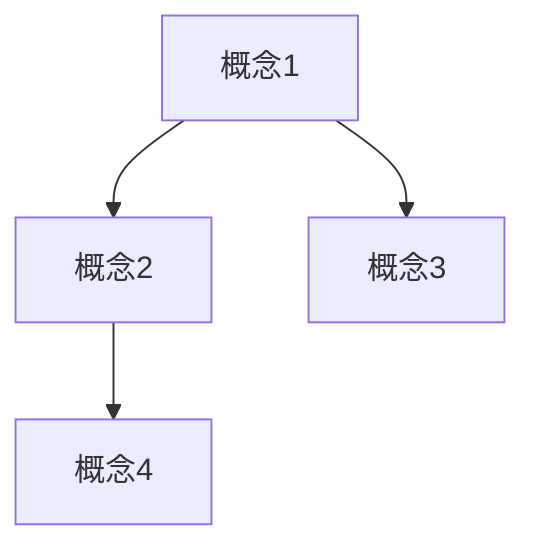

# 学习笔记助手

为学习内容创建结构化笔记：$ARGUMENTS

## 核心功能

### 1. 概念解释
- 识别笔记中的关键概念和术语
- 提供清晰、准确的定义
- 给出实际例子帮助理解
- 标注概念的重要程度

### 2. 知识关联
- 分析概念之间的关系（依赖、对比、层级等）
- 建立概念图谱
- 链接到相关的已有笔记
- 识别前置知识和延伸知识

### 3. 结构化组织
- 使用清晰的层级结构
- 添加可视化元素（图表、流程图）
- 提供快速索引和导航
- 支持双向链接

## 工作流程

1. **分析输入**
   - 如果提供了文件路径，读取文件内容
   - 识别其中的关键概念和知识点
   - 提取需要解释的术语

2. **概念解释**
   - 为每个概念提供定义
   - 说明概念的来源和背景
   - 给出具体例子
   - 标注难度级别

3. **建立关联**
   - 分析概念之间的关系类型：
     * **依赖关系**：A 是理解 B 的前提
     * **对比关系**：A 和 B 的异同
     * **层级关系**：A 是 B 的子概念
     * **应用关系**：A 在 B 场景中的应用
   - 生成概念关系图
   - 推荐相关学习资源

4. **生成笔记**
   - 使用模板生成结构化笔记
   - 添加元信息（日期、标签、难度）
   - 包含概念索引和关系图
   - 提供复习要点

## 笔记结构

```markdown
# 主题

## 元信息
- 日期：YYYY-MM-DD
- 标签：#tag1 #tag2
- 难度：⭐⭐⭐
- 状态：学习中/已掌握/需复习

## 核心概念

### 概念1
**定义**：...
**例子**：...
**关联**：→ [[概念2]], [[概念3]]

## 概念关系图



## 详细笔记

## 实践练习

## 复习要点

## 延伸阅读
```

## 使用示例

### 场景1：从现有文件生成笔记
```
/learning-notes 分析文件 ~/notes/react-hooks.md
```

### 场景2：创建新主题笔记
```
/learning-notes JavaScript 闭包
```

### 场景3：补充概念解释
```
/learning-notes 解释文件中的概念 ~/notes/database.md
```

## 概念关系类型

| 关系类型 | 符号 | 说明 | 示例 |
|---------|------|------|------|
| 依赖 | → | A 是 B 的前提 | 变量 → 闭包 |
| 对比 | ↔ | A 和 B 的对比 | let ↔ const |
| 包含 | ⊃ | A 包含 B | 数据结构 ⊃ 数组 |
| 应用 | ⇒ | A 应用于 B | 递归 ⇒ 树遍历 |
| 相关 | ⋯ | A 和 B 相关 | Promise ⋯ async/await |

## 输出格式

参考模板：[templates/note-template.md](templates/note-template.md)

查看示例：[examples/react-hooks-example.md](examples/react-hooks-example.md)
