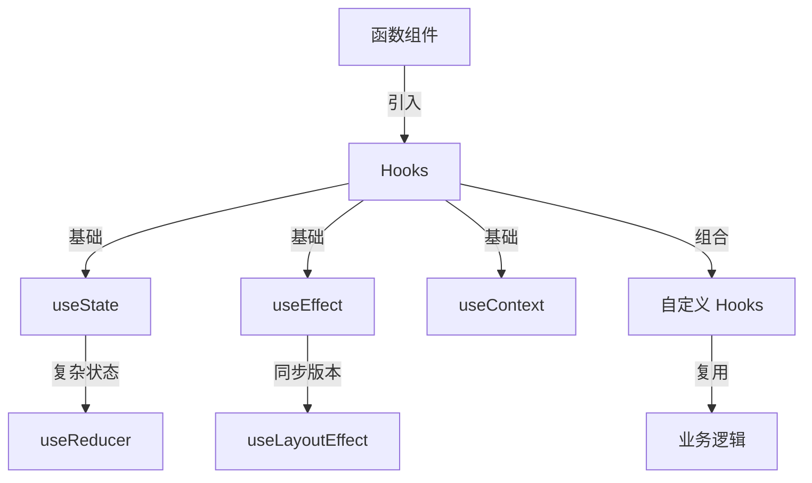

# React Hooks 深入理解

## 元信息
- 创建日期：2026-03-12
- 标签：#React #Hooks #前端开发 #状态管理
- 难度：4星
- 学习状态：已掌握

## 学习目标

- 理解 Hooks 的设计动机和解决的问题
- 掌握常用 Hooks 的使用方法
- 理解 Hooks 的规则和最佳实践
- 能够自定义 Hooks 封装逻辑

## 核心概念

### Hooks

**定义**
Hooks 是 React 16.8 引入的新特性，允许在函数组件中使用状态和其他 React 特性，而无需编写类组件。

**通俗解释**
可以把 Hooks 理解为"钩子"，它让函数组件能够"钩入" React 的特性（如状态、生命周期等）。就像给函数组件装上了类组件的能力。

**示例**
```javascript
import { useState } from 'react';

function Counter() {
  const [count, setCount] = useState(0);

  return (
    <div>
      <p>Count: {count}</p>
      <button onClick={() => setCount(count + 1)}>增加</button>
    </div>
  );
}
```

**重要程度**：5星

**关联概念**
- → [[函数组件]] (前置知识)
- → [[状态管理]] (前置知识)
- ⇒ [[自定义 Hooks]] (应用场景)
- ↔ [[类组件生命周期]] (对比学习)

---

### useState

**定义**
useState 是最基础的 Hook，用于在函数组件中添加状态。它返回一个状态值和更新该状态的函数。

**通俗解释**
useState 就像给组件添加了一个"记忆"，让它能记住数据。每次调用更新函数，组件会重新渲染并使用新的状态值。

**示例**
```javascript
const [name, setName] = useState('张三');
const [age, setAge] = useState(25);
const [isActive, setIsActive] = useState(false);

// 更新状态
setName('李四');
setAge(prevAge => prevAge + 1); // 使用函数式更新
```

**重要程度**：5星

**关联概念**
- → [[Hooks]] (是 Hooks 的一种)
- ⋯ [[useReducer]] (复杂状态管理的替代方案)
- ⇒ [[表单处理]] (应用场景)

---

### useEffect

**定义**
useEffect 用于在函数组件中执行副作用操作，如数据获取、订阅、手动修改 DOM 等。它相当于类组件中的 componentDidMount、componentDidUpdate 和 componentWillUnmount 的组合。

**通俗解释**
useEffect 让你在组件渲染后执行一些"额外的事情"。可以把它想象成"当某些事情发生时，做点什么"。

**示例**
```javascript
useEffect(() => {
  // 副作用代码
  document.title = `点击了 ${count} 次`;

  // 清理函数（可选）
  return () => {
    console.log('组件卸载或依赖变化前执行清理');
  };
}, [count]); // 依赖数组
```

**重要程度**：5星

**关联概念**
- → [[副作用]] (前置知识)
- → [[组件生命周期]] (前置知识)
- ⋯ [[useLayoutEffect]] (同步版本)
- ⇒ [[数据获取]] (应用场景)

---

### 自定义 Hooks

**定义**
自定义 Hooks 是以 "use" 开头的函数，内部可以调用其他 Hooks，用于提取和复用组件逻辑。

**通俗解释**
当多个组件需要相同的逻辑时，可以把这些逻辑提取到自定义 Hook 中，就像创建一个可复用的"工具箱"。

**示例**
```javascript
// 自定义 Hook：管理表单输入
function useInput(initialValue) {
  const [value, setValue] = useState(initialValue);

  const handleChange = (e) => {
    setValue(e.target.value);
  };

  return {
    value,
    onChange: handleChange,
    reset: () => setValue(initialValue)
  };
}

// 使用
function Form() {
  const username = useInput('');
  const email = useInput('');

  return (
    <form>
      <input {...username} placeholder="用户名" />
      <input {...email} placeholder="邮箱" />
    </form>
  );
}
```

**重要程度**：4星

**关联概念**
- → [[Hooks]] (基于 Hooks 构建)
- → [[逻辑复用]] (解决的问题)
- ⇒ [[代码组织]] (应用场景)

---

## 概念关系图



**关系说明**
- Hooks 是函数组件使用 React 特性的基础
- useState 和 useEffect 是最常用的两个基础 Hooks
- useReducer 是 useState 的替代方案，适合复杂状态
- 自定义 Hooks 通过组合基础 Hooks 实现逻辑复用

## 详细笔记

### Hooks 的设计动机

在 Hooks 出现之前，React 组件的逻辑复用主要通过高阶组件 (HOC)、Render Props 和类组件的生命周期方法。这些方式存在的问题：
- 组件嵌套层级深（"嵌套地狱"）
- 逻辑难以复用和测试
- 类组件的 this 绑定问题
- 生命周期方法中逻辑分散

**Hooks 的优势**
- 更简洁的代码
- 更好的逻辑复用
- 更容易理解和测试
- 更小的打包体积

**关键点**
- Hooks 让函数组件拥有了状态和副作用能力
- 通过自定义 Hooks 实现逻辑复用
- 遵循 Hooks 规则确保正确性

**常见误区**
不要在循环、条件或嵌套函数中调用 Hooks。Hooks 必须在组件的顶层调用，以确保每次渲染时 Hooks 的调用顺序一致。

### Hooks 规则

React 对 Hooks 的使用有两条重要规则：

1. **只在顶层调用 Hooks**
   - 不要在循环、条件或嵌套函数中调用
   - 在函数组件的顶层调用

2. **只在 React 函数中调用 Hooks**
   - 在函数组件中调用
   - 在自定义 Hooks 中调用
   - 不要在普通 JavaScript 函数中调用

**最佳实践**
- 使用 ESLint 插件 `eslint-plugin-react-hooks` 自动检查
- 自定义 Hooks 以 "use" 开头命名
- 合理使用依赖数组避免不必要的重渲染

### useState 详解

useState 接受初始值作为参数，返回一个数组，包含当前状态值和更新函数。

**函数式更新**
当新状态依赖于旧状态时，应该使用函数式更新：
```javascript
setCount(prevCount => prevCount + 1);
```

这样可以避免闭包陷阱，确保基于最新的状态值更新。

**惰性初始化**
如果初始值需要复杂计算，可以传入函数：
```javascript
const [state, setState] = useState(() => {
  return expensiveComputation();
});
```

### useEffect 详解

useEffect 接受两个参数：副作用函数和依赖数组。

**依赖数组的三种情况**
1. 无依赖数组：每次渲染都执行
2. 空数组 `[]`：只在挂载时执行一次
3. 有依赖 `[dep1, dep2]`：依赖变化时执行

**清理函数**
副作用函数可以返回一个清理函数，在组件卸载或下次副作用执行前调用：
```javascript
useEffect(() => {
  const subscription = subscribe();
  return () => {
    subscription.unsubscribe();
  };
}, []);
```

## 知识网络

### 前置知识
- [[React 基础]] - 组件、props、state 的概念
- [[函数组件]] - 理解函数组件的工作方式
- [[JavaScript 闭包]] - 理解 Hooks 的实现原理

### 相关主题
- [[React 状态管理]] - Redux、Zustand 等状态管理方案
- [[React 性能优化]] - useMemo、useCallback 的使用
- [[React Context]] - 跨组件状态共享

### 延伸学习
- [[自定义 Hooks 最佳实践]] - 如何设计好的自定义 Hooks
- [[React 并发特性]] - useTransition、useDeferredValue
- [[React Server Components]] - 服务端组件

## 快速回顾

- **Hooks**：让函数组件拥有状态和副作用能力的特殊函数
- **useState**：在函数组件中添加状态，返回 [状态值, 更新函数]
- **useEffect**：执行副作用操作，可以指定依赖数组控制执行时机
- **自定义 Hooks**：提取和复用组件逻辑，必须以 "use" 开头
- **Hooks 规则**：只在顶层调用，只在 React 函数中调用

## 参考资源

- [React Hooks 官方文档](https://react.dev/reference/react) - 最权威的参考
- [A Complete Guide to useEffect](https://overreacted.io/a-complete-guide-to-useeffect/) - Dan Abramov 深度解析
- [Making Sense of React Hooks](https://medium.com/@dan_abramov/making-sense-of-react-hooks-fdbde8803889) - Hooks 设计动机

## 个人思考

Hooks 真正改变了 React 的开发方式。最初接触时觉得有点"魔法"，但理解了闭包和调用顺序后就豁然开朗。

自定义 Hooks 是最强大的特性，它让逻辑复用变得如此简单。相比 HOC 和 Render Props，代码更清晰、更容易理解。

需要注意的是依赖数组的管理，这是新手最容易出错的地方。建议使用 ESLint 插件自动检查。

---

最后更新：2026-03-12
