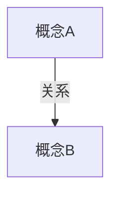

# Thinking Style

Use this file when generating a note for the `thinking/` vault.

## Default Skeleton

```md
# 标题 (English term if useful)

## 元信息
- 创建日期：YYYY-MM-DD
- 标签： #tag1 #tag2
- 难度：3

## 定义

用 1-3 段回答“它是什么”“为什么重要”。

## 核心观点

- **观点1**：展开解释。
- **观点2**：展开解释。
- **观点3**：展开解释。

## 概念关系图



## 关联概念

- → [[前置概念]]：说明为什么它是前置
- ⇒ [[应用概念]]：说明为什么它是应用或结果
- ↔ [[对比概念]]：说明二者的关系
- ⋯ [[相关概念]]：说明关联点

## 延伸

[[概念1]] · [[概念2]] · [[概念3]]

## 参考

- [来源名称](https://example.com)

---

最后更新：YYYY-MM-DD
```

## Style Rules

- Default to Chinese, but preserve key English terms in parentheses when useful.
- Write like a knowledge-card author, not like a lecturer.
- Prefer a small number of strong claims over exhaustive exposition.
- Make each card stand alone while still linking into the larger knowledge network.
- Use optional sections only when the subject needs them. Good examples:
  - `核心技术栈` for engineering roles or technical systems
  - `背景` for contextual notes
  - `业务演进脉络` for case-analysis notes
  - `详细笔记` for foundational theory notes

## Common Patterns In Existing Cards

- Concept cards: `定义 -> 核心观点 -> 概念关系图 -> 关联概念`
- Role cards: add `核心技术栈`
- Case-analysis cards: add `背景` or `业务演进脉络`
- Theory cards: may add `核心概念` or `详细笔记`

## What To Avoid

- Do not default to “学习目标 / 复习要点 / 练习题”.
- Do not produce a classroom handout tone.
- Do not leave bare links without explaining why they matter.
- Do not add sections just because the template allows them.
